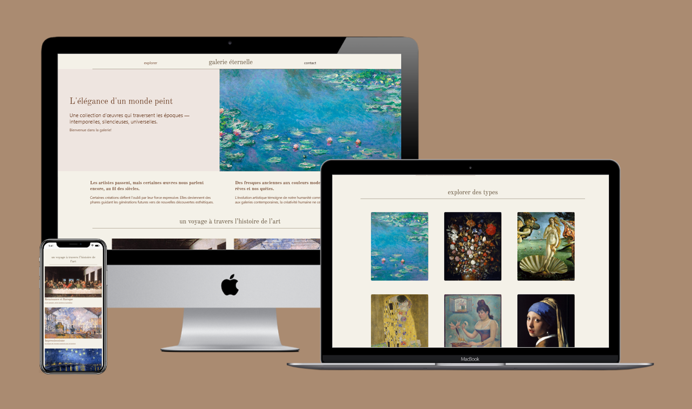

## 🖼️ Preview

  

## Projet 00 – Site Web Responsive
Un site web simple et responsive de deux pages, développé en **HTML** et **CSS**. Ce projet met l'accent sur une structure claire, un design adaptatif, et une navigation entre pages.
- HTML5  
- CSS3
- Design responsive (media queries)

## 📄 Pages  
- Page d'accueil  
- Page À propos

## 🚀 Démo en ligne  
🔗 [Voir le site](https://nbhd12.github.io/projet00/index.html)

## Project 00 – Responsive Website (EN)

A simple and responsive two-page website built with **HTML** and **CSS**. This project focuses on clean structure, responsive layout, and basic multi-page navigation.
- HTML5  
- CSS3  
- Responsive design (media queries)

## 📄 Pages  
- Home Page  
- About Page

## 🚀 Live Preview  
🔗 [View Website](https://nbhd12.github.io/projet00/index.html)
